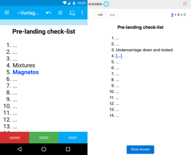

## Cloze Overlapper Add-on for Anki

Facilitates **memorizing enumerations**, lists, or any other type of sequential information by breaking the sequence up into cards where each item serves as the context cue for the next:

### Table of Contents

<!-- MarkdownTOC -->

- [Background](#background)
- [The Add-on](#the-add-on)
- [Documentation](#documentation)
- [Credits and License](#credits-and-license)

<!-- /MarkdownTOC -->

### Background
 
Memorizing lists and enumerations has always been a particularly difficult part of studying flashcards. Good flashcards follow the **minimum information principle**, where each card is kept as short as possible. Sequential information has unfortunately always somewhat eluded that basic principle because it is hard to break down into smaller chunks. Normally you would employ methods like grouping or categorizing to consolidate information, but with each item building upon the next, that does usually not work for sequences or enumerations.

One of the [common recommendations](https://www.supermemo.com/en/articles/20rules#Enumerations) in cases like this has always been to create **overlapping flashcards**, where each card's answer serves as the question prompt for next card in line. For an array of three list items A, B, C you would end up with three cards of the form A → B, B → C, and C → D. What results is chain of overlapping associations between each sequence node that can potentially improve the storage and retrieval strength of the entire sequence.

While this method is generally assumed to be quite effective, following it requires a significant **time investment** up-front that only few students are able or willing to make.

### The Add-on

This is where *Cloze Overlapper* comes in. It takes care of all the arduous steps required to create these flashcards manually and provides you with a dead-simple workflow: You paste in the sequence or list, adjust the cloze generation settings, and let the add-on generate the cards for you. 

More generally speaking, *Cloze Overlaper* provides Anki with a completely novel cloze system that can cover almost every use case you can think of, be it revealing each taxon of a classification system individually, or even gradually building up to an entire poem:

Due to working with the formatting tools that Anki provides itself, the cards generated by this add-on are fully **compatible with all Anki platforms**, smartphone apps included:

### Documentation

The installation and use of the add-on is documented in the [Wiki section](https://github.com/Glutanimate/cloze-overlapper/wiki) and a [series of video tutorials on YouTube](https://www.youtube.com/watch?v=QzBoDe3PgAc&list=PL3MozITKTz5Y9owI163AJMYqKwhFrTKcT). More information may also be found in the [AnkiWeb description](docs/description.md).

### Credits and License

*Cloze Overlapper* is *Copyright © 2016-2018 [Aristotelis P.](https://glutanimate.com)*

With contributions by: [zjosua](https://github.com/zjosua), (Thank you!)

I would like to extend my heartfelt thanks to everyone who has helped with testing, provided suggestions, or contributed in any other way!

I'd also like to thank:

- [Piotr Wozniak](https://www.supermemo.com/english/company/wozniak.htm) for laying the theoretical groundwork for overlapping cloze deletions with his [20 rules of formulating knowledge](https://www.supermemo.com/en/articles/20rules)
- [Soren Bjornstad](https://github.com/sobjornstad) for giving me the inspiration for this add-on with his project [AnkiLPCG](https://github.com/sobjornstad/AnkiLPCG), back when it was still a standalone module

Licensed under the [GNU AGPL v3](https://www.gnu.org/licenses/agpl.html).
